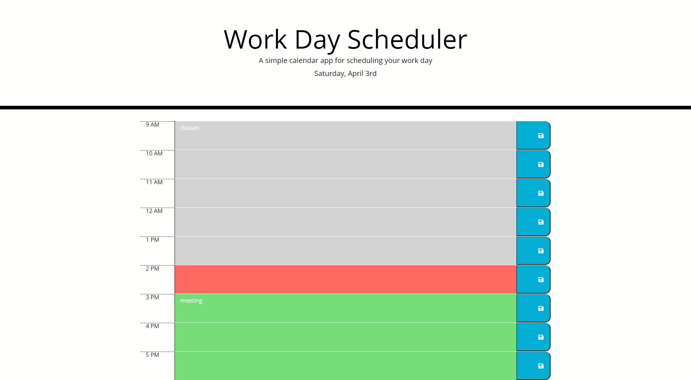

# Work-Day_Scheduler

## Project Link

Click [here](https://iwanagahime.github.io/Work-Day-Scheduler-/) to view project on GitHub pages.

## Description

We were asked to create a simple calendar application that allows a user to save events for each hour of the day by modifying starter code. This app runs in the browser and features dynamically updated HTML and CSS powered by jQuery.

We used the [Moment.js](https://momentjs.com/) library to work with date and time.

## What did we do?

- Declared a renderCurrentDate function that displays current formatted date in the p element of index.html (Moment.js)
- Declared onReady function that was constructed as a series of steps including:
- getting data from local storage and
- declaring and populating timeBlocksArray
- rendering time classes on time blocks
- matching events with time blocks
- saving events in local storage using onClick function
- Format code using prettier

## Getting started

- Clone the GitHub project onto your local machine
- Navigate into the project
- Open the project in VSCode
- Open the `script.js` file in your default browser

```
git clone https://iwanagahime.github.io/Work-Day-Scheduler-/
code .
```

## Screenshots

###



###


